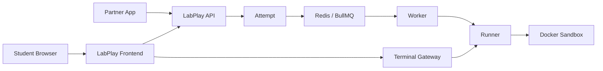

# LabPlay

Standalone, integration-first interactive lab platform for isolated coding and Linux exercises.


It can be launched from another application through a secure server-to-server integration.
Each learner attempt receives an isolated Docker sandbox, while grading and lifecycle operations are processed asynchronously through Redis and BullMQ.

## Highlights

- Secure partner-to-LabPlay launch using RS256 JWTs
- One isolated Docker sandbox per Attempt
- Redis + BullMQ background job processing
- Async Run / Check grading
- Browser Linux terminal via WebSockets
- Monaco code editor
- Signed completion webhooks
- Lab versioning and admin panel
- Automatic sandbox cleanup

## Architecture

## Architecture



## Tech Stack

Frontend:
React, Vite, Axios, Monaco Editor, xterm.js

Backend:
Node.js, Express, MongoDB, Redis, BullMQ

Infrastructure:
Docker, WebSockets

Security:
RS256 JWT, HttpOnly sessions, HMAC webhooks


## Local Development

Start:

```bash
# backend
npm run dev

# workers
npm run worker

# runner
npm run dev

# terminal gateway
npm run dev

# frontend
npm run dev

Author

Built as a full-stack / DevOps engineering project focused on secure integrations, distributed job processing, containerized sandbox execution and production-oriented system design.


